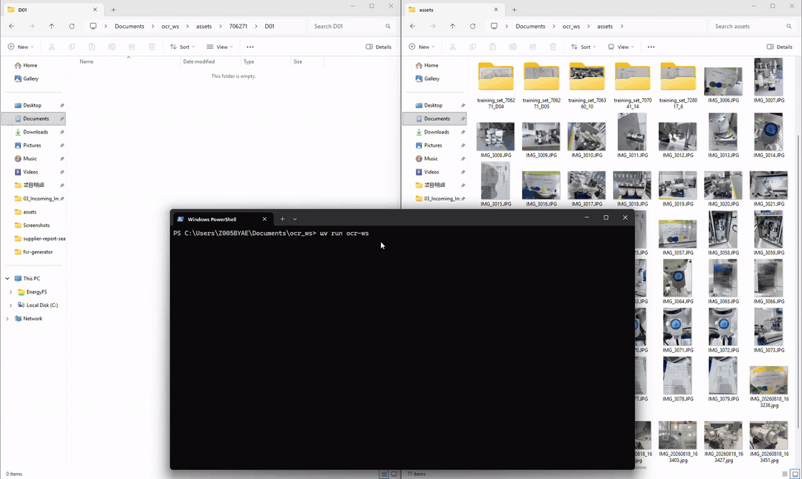

# 图片识别+归档辅助脚本
这是用来给FQC做照片归档的仓库


## 原理
采用了RapidOCR来对终检拍摄的照片进行文字识别。

RapidOCR在PaddleOCR视觉模型的基础上进行了优化，更轻量化和节省资源。

在这个项目中主要通过识别三个字段来对图片进行分类：

- ```项目号```: 一个 ```6位数```
  
- ```间隔号```：一个 ```字母 (A-N) + 数字``` 的组合
  
- ```运输单元号```： 多个 ```字母 (O-Z) + 数字``` 的组合

只有当这三个字段都能被识别到时，才会作为一组图片的首张，并将后续图片都依照识别的信息归类到对应文件夹中。

## 设置
1. 将本仓库clone到本地
```bash
git clone https://github.com/YiminHu26/fqc_photo_management.git
```
1. 阅读[教程](https://docs.astral.sh/uv/getting-started/installation/),下载uv,这里我用winget方法
```bash
winget install --id=astral-sh.uv  -e
```

## 使用
1. 在根目录下新建assets文件夹
1. 把所有图片复制到assets文件夹下，不用重命名，不用分类
    - 确保唛头永远是一台设备所有照片的第一张（最早拍的），这样运行才能成功
    - 确保照片的格式是.jpg, .jpeg, .png, .bmp, .tif, .tiff中的一种, .HEIC格式会被转换为.png格式
1. 在根目录下运行
```
uv run ocr-ws
```